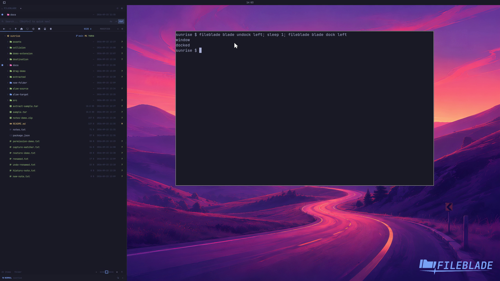

This file was written by an agent.

# Dock and float a blade

Undock a blade into a window when you need a movable sidebar. Dock it again to reserve space at its original edge.

```sh
fileblade blade undock left
fileblade blade dock left
```

Demonstration: The Files pane changes placement and returns with the same folder.

Evidence reviewed.



[Watch the focused demonstration](docking.mp4) (5.87 seconds; muted, original speed).

Capture source: `8e07a7eb93ddac81af15a9d35eaf21d6171833ae`. See the [evidence standard](../evidence.md) and [coverage](../catalog.json).
