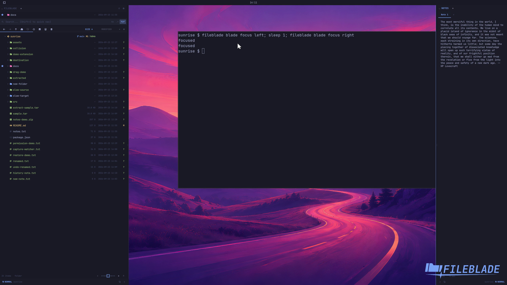

This file was written by an agent.

# Move focus between blades and applications

Focus a blade before using its keyboard navigation. Use release to return keyboard input to the application.

```sh
fileblade blade focus left
fileblade blade focus right
fileblade blade release
```

Demonstration: Focus moves from the left blade to the right blade.

The clip covers switching blades; returning to an application is a separate command.

Evidence reviewed.



[Watch the focused demonstration](focus.mp4) (5.87 seconds; muted, original speed).

Capture source: `8e07a7eb93ddac81af15a9d35eaf21d6171833ae`. See the [evidence standard](../evidence.md) and [coverage](../catalog.json).
