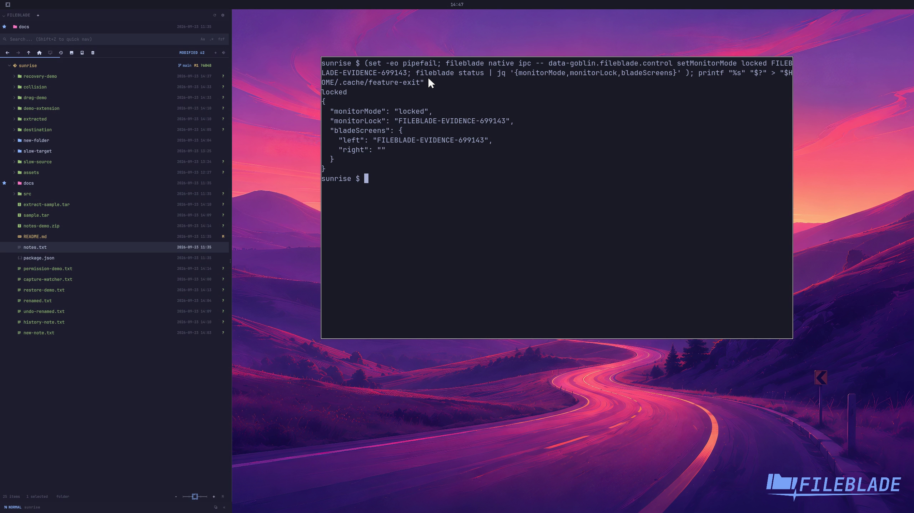

This file was written by an agent.

# Choose where blades appear

Open blade settings to choose the active monitor, all monitors, or a named monitor. A named lock keeps placement tied to that output.

```sh
fileblade blade settings left
```

Demonstration: The capture locks its blade to its actual named output and reports that output.

Only one output is present in this recording; it does not demonstrate switching physical monitors.

Evidence reviewed.



[Watch the focused demonstration](monitors.mp4) (5.97 seconds; muted, original speed).

Capture source: `c3e48bbee4f8e6c5adf0e12a3b1781ed6f6af833`. See the [evidence standard](../evidence.md) and [coverage](../catalog.json).
