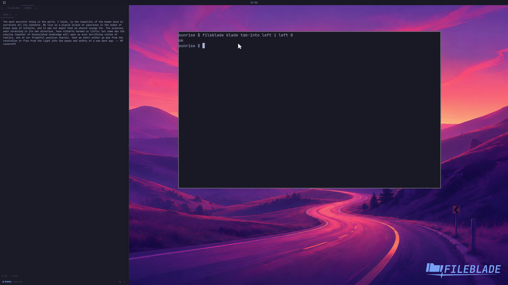

This file was written by an agent.

# Move tabs between sections

Move a section's pane into another section as a tab. The destination retains its existing panes.

```sh
fileblade blade tab-into left 1 left 0
```

Demonstration: The second section moves into the first section's tab strip.

Evidence reviewed.



[Watch the focused demonstration](move-tabs.mp4) (5.83 seconds; muted, original speed).

Capture source: `8e07a7eb93ddac81af15a9d35eaf21d6171833ae`. See the [evidence standard](../evidence.md) and [coverage](../catalog.json).
