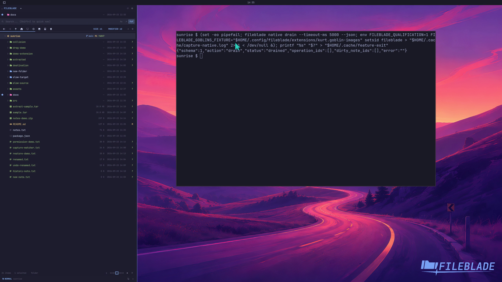

This file was written by an agent.

# Restore saved layouts

Layouts and pane state are saved automatically. Closing and reopening the native view restores the saved arrangement.

```sh
fileblade blades
```

Demonstration: A restarted native view restores the recorded pane layout and width.

The recording restarts only a disposable profile.

Evidence reviewed.



[Watch the focused demonstration](persistence.mp4) (5.97 seconds; muted, original speed).

Capture source: `3db27943d1b3a31e155febf9cf0928fb7bb6eb63`. See the [evidence standard](../evidence.md) and [coverage](../catalog.json).
