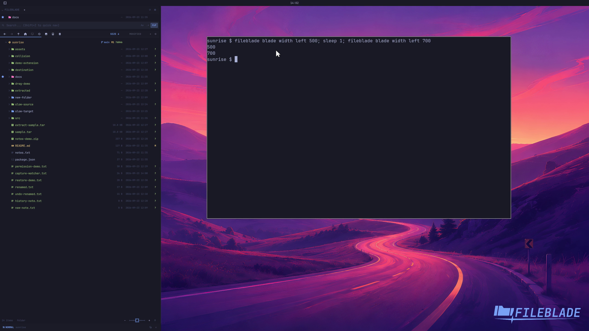

This file was written by an agent.

# Resize a blade

Drag the blade edge or set its width in pixels. A docked blade reserves its new width beside tiled applications.

```sh
fileblade blade width left 500
fileblade blade width left 700
```

Demonstration: The blade widens from 500 to 700 pixels. Both widths remain below one-third of the recorded screen.

Evidence reviewed.



[Watch the focused demonstration](resizing.mp4) (5.87 seconds; muted, original speed).

Capture source: `8e07a7eb93ddac81af15a9d35eaf21d6171833ae`. See the [evidence standard](../evidence.md) and [coverage](../catalog.json).
