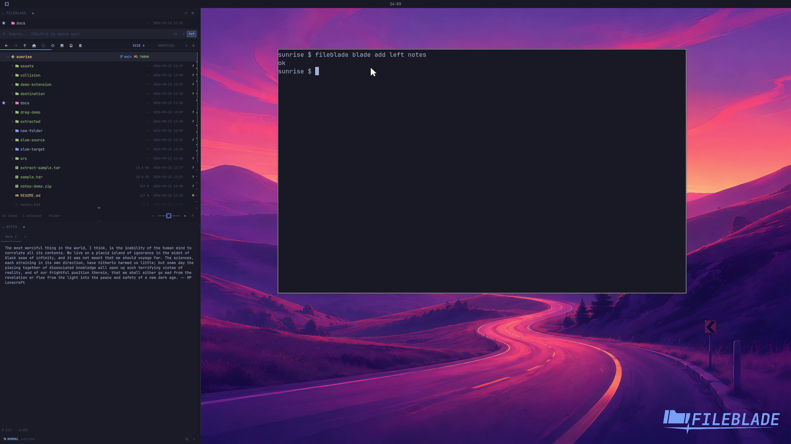

This file was written by an agent.

# Arrange sections

Add another pane as a section within a blade. Each section has its own pane state and can contain tabs.

```sh
fileblade blade add left notes
```

Demonstration: A Notes section appears alongside the existing Files section.

This clip proves adding a section, not every rearrangement gesture.

Evidence reviewed.



[Watch the focused demonstration](sections.mp4) (5.83 seconds; muted, original speed).

Capture source: `8e07a7eb93ddac81af15a9d35eaf21d6171833ae`. See the [evidence standard](../evidence.md) and [coverage](../catalog.json).
