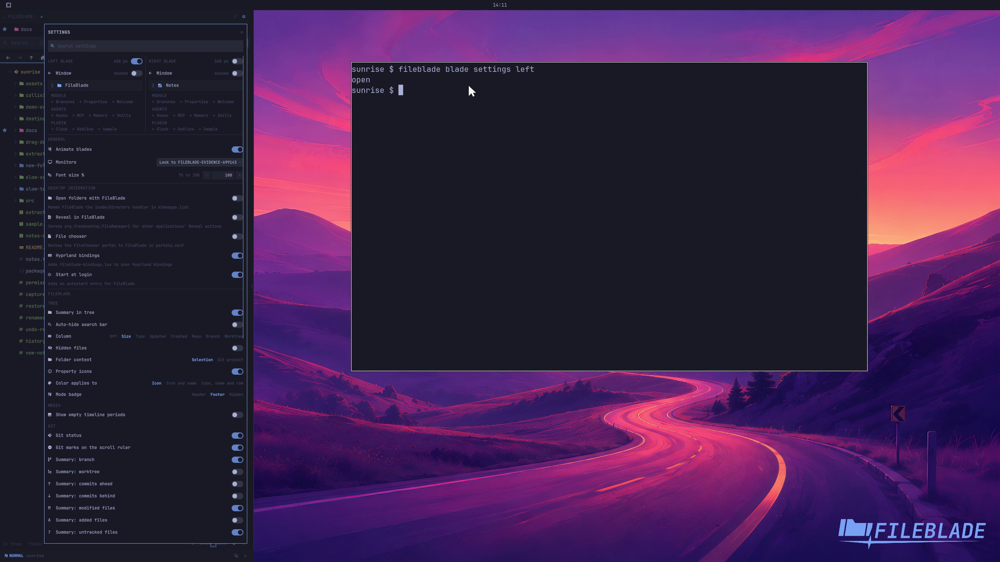

This file was written by an agent.

# Configure blade behavior

Open the settings panel from the blade gear. Search for a preference to find controls for panes, appearance, placement, and desktop integrations.

```sh
fileblade blade settings left
```

Demonstration: The live settings form opens with the blade's current preferences.

The clip demonstrates opening the form, not saving every setting.

Evidence reviewed.



[Watch the focused demonstration](settings.mp4) (5.83 seconds; muted, original speed).

Capture source: `8e07a7eb93ddac81af15a9d35eaf21d6171833ae`. See the [evidence standard](../evidence.md) and [coverage](../catalog.json).
