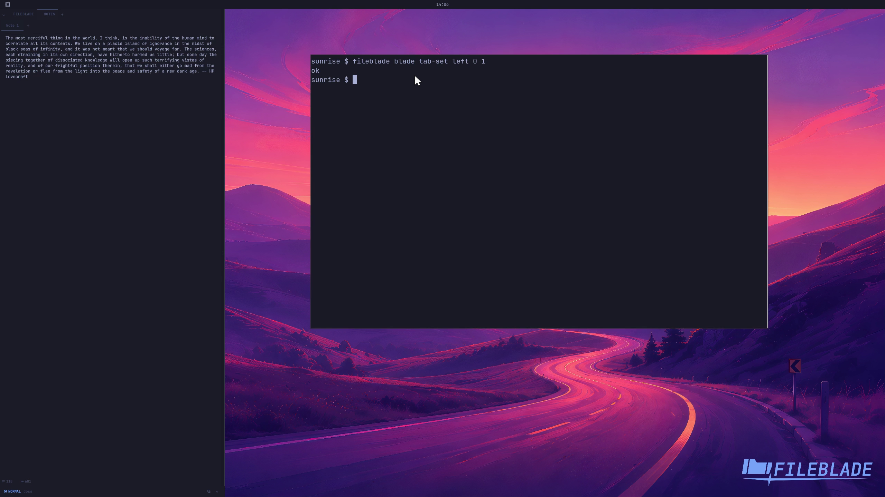

This file was written by an agent.

# Switch pane tabs

Tabs share a section. Select a tab to show its pane while retaining the other tab's state. Slot and tab numbers in the CLI start at zero.

```sh
fileblade blade tab-set left 0 1
```

Demonstration: The second tab becomes active in the first section.

Closing tabs is supported by the tab menu but is not demonstrated in this clip.

Evidence reviewed.



[Watch the focused demonstration](tabs.mp4) (5.83 seconds; muted, original speed).

Capture source: `8e07a7eb93ddac81af15a9d35eaf21d6171833ae`. See the [evidence standard](../evidence.md) and [coverage](../catalog.json).
