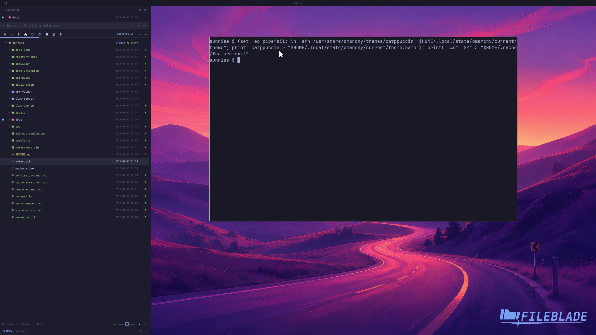

This file was written by an agent.

# Follow Omarchy themes

FileBlade follows the active Omarchy theme. Change the desktop theme with Omarchy's theme selector; the blade updates its colors.

Demonstration: The capture profile changes from Tokyo Night to Catppuccin.

The recording uses the private profile's theme files and does not change the working desktop.

Evidence reviewed.

[Watch the focused demonstration](theme.mp4) (5.97 seconds; muted, original speed).

Capture source: `c3e48bbee4f8e6c5adf0e12a3b1781ed6f6af833`. See the [evidence standard](../evidence.md) and [coverage](../catalog.json).
